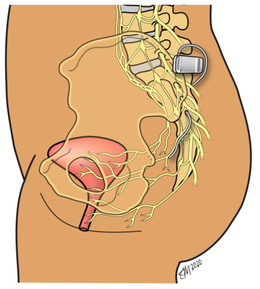

## Sacral Nerve Stimulation 

My work in the Bourbeau lab is focused on sexual dysfunction, a common outcome from spinal cord injury (SCI) which heavily impacts quality of life. While sexual dysfunction is common in SCI, it is often overlooked as a research priority, especially in women. Most current sexual health therapies focus on male arousal or female reproductive health. Other aspects of female sexual health, such as arousal, are overlooked. Sacral neuromodulation (SNM) has been annecdotally reported to improve sexual function, especially with chronic use. We are interested in the use of SNM for restoration of arousal in women with SCI.   

----

## Sexual Dysfunction 

I am generally interested in sexual dysfunction, with particular interest in genito-pelvic pain and penetration disorders. Below is my presentation given at the 2022 Ohio Academy of Nurse Midwives Forward. 

---

